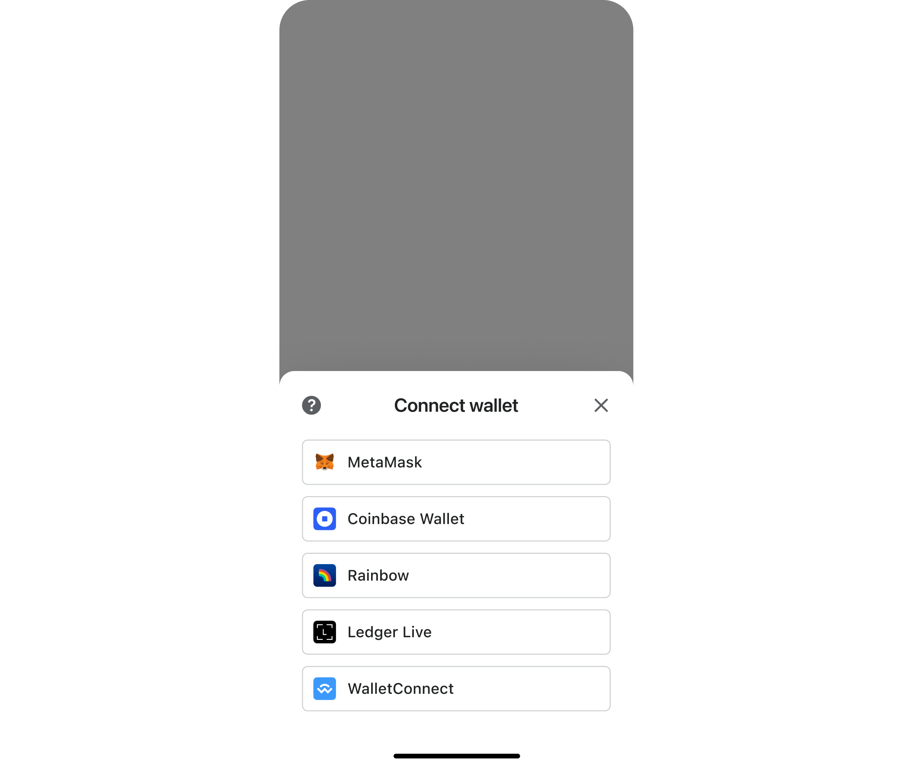
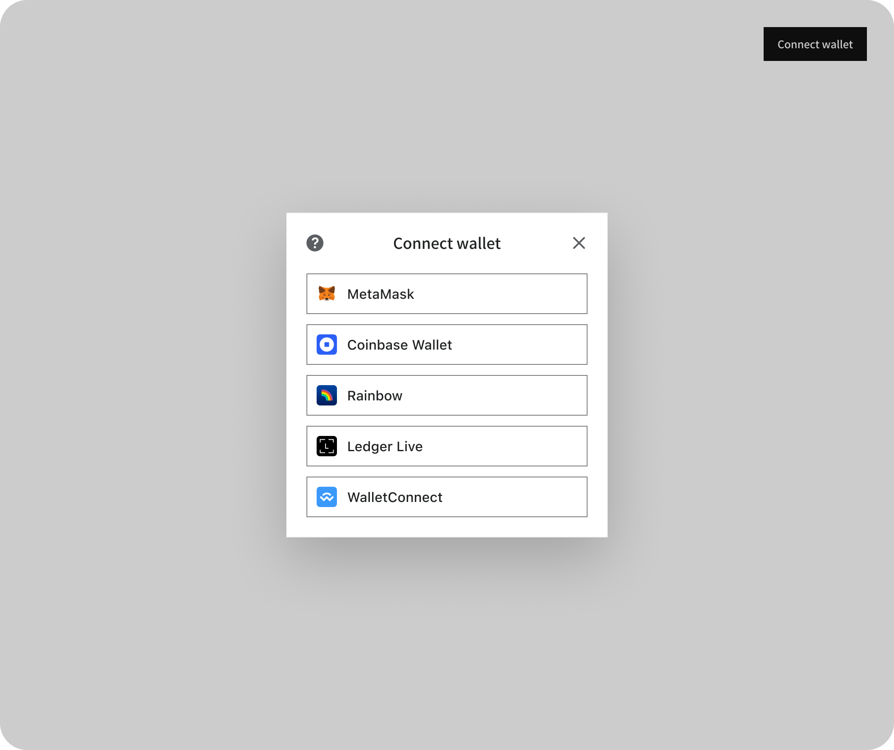
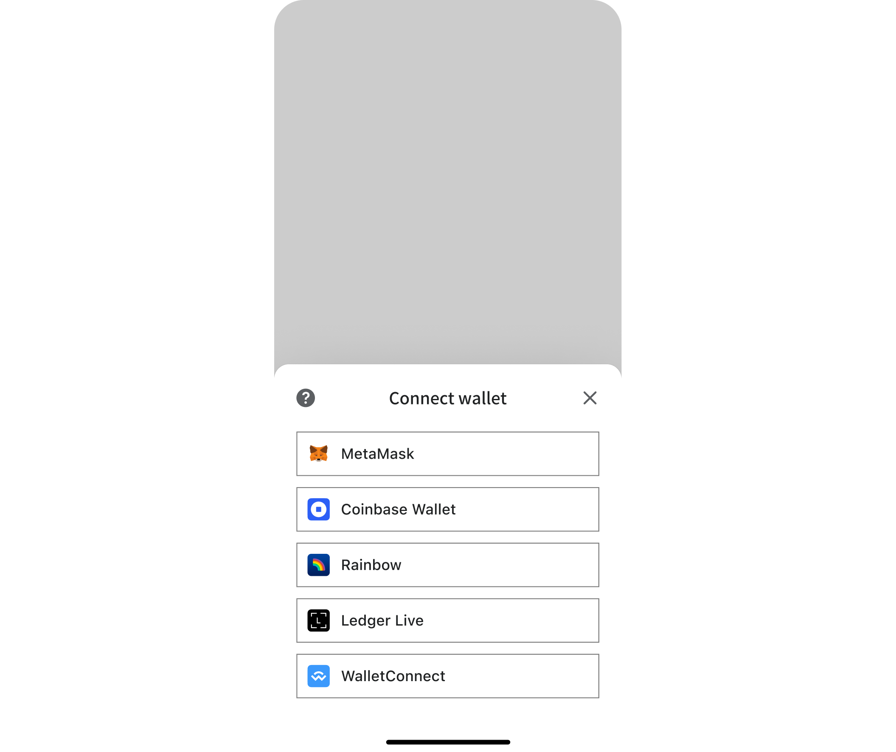

import Tabs from '@theme/Tabs';
import TabItem from '@theme/TabItem';

### Default

<Tabs>
  <TabItem value="desktop" label="Desktop" default>

  </TabItem>
  <TabItem value="mobile" label="Mobile">

  </TabItem>
</Tabs>

### Dawn

<Tabs>
  <TabItem value="desktop" label="Desktop" default>

  </TabItem>
  <TabItem value="mobile" label="Mobile">

  </TabItem>
</Tabs>

## Custom themes

Support for custom themes is built in, allowing you to override nearly every aspect of the appearance of your connect wallet integration.

For more about the structure of custom themes, view the [custom theming page](/advanced/custom-themes).
